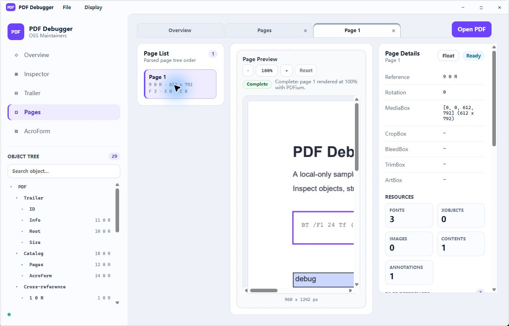

# PDF Debugger for OSS Maintainers

**DevTools for local PDF debugging.**

PDF Debugger for OSS Maintainers helps PDF library maintainers, renderer authors,
QA engineers, and support teams inspect broken or surprising PDF files without
opening a hex editor first.

It is not a general PDF reader. It is built for questions like:

- Which object, stream, trailer entry, annotation, page resource, or xref entry is involved?
- Why does this file parse or render differently across engines?
- Can I produce a concise local report for a GitHub issue or CI failure?
- What changed after a small experimental object or content-stream edit?



## Why

- **Inspect structure, not just pages.** Browse the trailer, catalog, page tree,
  indirect objects, streams, AcroForm fields, and page references.
- **Keep debugging local.** PDFs, streams, previews, and reports stay on your
  machine. No upload, cloud sync, or AI summarization is part of the MVP.
- **Correlate page output with PDF internals.** Use PDFium page preview beside
  page boxes, resource counts, page references, and extracted page objects.
- **Work from GUI or CLI.** Use the Tauri desktop app for interactive inspection
  and the Rust CLI for scripts, diagnostics, and issue reports.
- **Fail recoverably.** Malformed objects, unsupported stream filters, renderer
  failures, and full-load errors are shown as recoverable errors where possible.

## Install

The project is currently source-first.

Requirements:

- Rust toolchain with Cargo
- Node.js and npm

Install desktop dependencies:

```bash
npm install
```

Prepare the PDFium runtime used by Page Preview:

```bash
npm run pdfium:prepare
```

If direct GitHub access is blocked in your environment, the preparation script
retries through configured proxy variables and then `http://127.0.0.1:7897`.
You can also provide a proxy explicitly:

```powershell
$env:PDFIUM_BINARY_PROXY="http://127.0.0.1:7897"
npm run pdfium:prepare
```

## Desktop GUI

Start the app in development mode:

```bash
npm run tauri dev
```

Build a desktop release package:

```bash
npm run tauri:build
```

The Windows GUI build is configured as a windowed Tauri app with custom frameless
chrome, so release executables should not open an extra console window.

### Open A PDF

Use **Open PDF**, drag a local `.pdf` file into the window, or reopen a local
file from the recent PDF list.

The GUI uses a **full-load-only** document lifecycle:

1. Open a local PDF.
2. Wait for the full parser load and GUI-ready structures to finish.
3. Use Overview, Inspector, Trailer, Pages, AcroForm, Stream Viewer, editing, and
   Page Preview after the document is ready.

During loading, document-dependent workspaces are disabled or blocked with a
clear loading state. The GUI does not expose lazy interactive opening; files
above the current full-parse limit fail recoverably instead of opening as a
partial metadata-only workspace.

### Workspaces

- **Overview** shows file metadata, parser status, page-list status, object
  counts, xref counts, stream counts, and recoverable parser warnings.
- **Object Tree** lists the fully loaded structure, includes a local search box,
  and opens indirect objects in Object Inspector tabs.
- **Inspector** shows structured `Key / Type / Value` object details, expandable
  references, stream dictionary metadata, and limited experimental value editing.
- **Trailer** shows a resizable-column tree table for the trailer dictionary and
  inline reference expansion.
- **Pages** shows a searchable page list, Page Preview, Page Details, Page
  References, extracted Page Objects, and a floatable Page Metadata panel.
- **AcroForm** lists read-only terminal fields sorted by qualified field name.
- **Stream Viewer** opens from stream objects and loads metadata first, then Hex,
  Decoded, image preview, or content analysis on demand.

### Page Preview

Page Preview renders selected pages through PDFium when the runtime is available.
Rendering is latest-only for rapid page switching, stale results are ignored, and
the debug log records render-stage timing. Cached preview bitmaps are invalidated
when a PDF is reopened or saved.

### Stream Viewer

Stream Viewer is metadata-first:

- Hex and Decoded tabs load independently.
- Large previews use bounded/chunked rendering so the WebView does not mount a
  huge `<pre>` block.
- Decoded previews may be truncated to keep the GUI responsive.
- Decoded exports require explicit local file output.
- Image XObject preview is experimental and supports only common local decodes
  such as 8-bit DeviceGray, DeviceRGB, DeviceCMYK, and some DCTDecode/JPEG cases.

### Experimental Editing

The GUI includes a limited local editing workflow for debugging hypotheses.

Supported today:

- Double-click eligible Object Inspector `Value` cells to edit existing
  `Number`, `String`, and `Name` values.
- Edit some decoded content streams when the full decoded text is available and
  supported by the current stream path.
- Revert object edits or all edits before saving.
- Use `Ctrl+S` or **File -> Save** for in-place safe-write replacement.
- Use **File -> Save As** to write a separate modified PDF.
- Reopen the saved PDF and clear stale object/page/preview caches after save.

Still experimental or deferred:

- Broad PDF editing
- Encrypted PDF editing
- Signature preservation
- Incremental update authoring
- Arbitrary binary stream editing
- Object creation/deletion at the xref level
- Full appearance regeneration for forms or annotations
- Reliable re-encoding for every filter/color-space combination

## CLI

Build and test the Rust core:

```bash
cargo build
cargo test
```

Run from source:

```bash
cargo run -- inspect sample.pdf
```

The CLI binary name is:

```bash
pdf-debugger
```

### Inspect

Show file metadata:

```bash
pdf-debugger inspect sample.pdf
```

Show a JSON structure tree:

```bash
pdf-debugger inspect sample.pdf --structure
```

### Dump Objects

Dump raw object source:

```bash
pdf-debugger dump-object sample.pdf 12 0
```

Dump parsed object summary JSON:

```bash
pdf-debugger dump-object sample.pdf 12 0 --json
```

### Dump Streams

Dump raw stream bytes:

```bash
pdf-debugger dump-stream sample.pdf 24 0
```

Write decoded stream bytes:

```bash
pdf-debugger dump-stream sample.pdf 24 0 --decoded out.txt
```

Show stream JSON, hex, or content-operator analysis:

```bash
pdf-debugger dump-stream sample.pdf 24 0 --json
pdf-debugger dump-stream sample.pdf 24 0 --hex
pdf-debugger dump-stream sample.pdf 24 0 --content-json
```

### Diagnostics And Reports

Run diagnostics and write reports:

```bash
pdf-debugger check sample.pdf --json report.json
pdf-debugger check sample.pdf --markdown report.md
```

If no report path is supplied, `check` prints JSON to stdout:

```bash
pdf-debugger check sample.pdf
```

Exit codes:

- `0`: no error-severity diagnostics
- `1`: one or more error-severity diagnostics
- `2`: CLI usage or runtime error

### Large-PDF CLI Tools

The desktop GUI no longer exposes lazy interactive opening, but the CLI still
contains lazy inspection/report paths for local diagnostics and CI workflows:

```bash
pdf-debugger lazy-inspect large.pdf
pdf-debugger lazy-inspect large.pdf --structure
pdf-debugger lazy-inspect large.pdf --page-list
pdf-debugger lazy-inspect large.pdf --pages
pdf-debugger lazy-inspect large.pdf --object 12 0
pdf-debugger lazy-inspect large.pdf --stream 24 0
pdf-debugger lazy-inspect large.pdf --diagnostics
```

Large-report enrichments are explicit:

```bash
pdf-debugger check large.pdf --markdown report.md --lazy-page 1 --lazy-stream 24 0 --lazy-object 12 0
```

Lazy reports clearly mark deep diagnostics as deferred unless a selected page,
stream, or object enrichment was requested.

## Current MVP Scope

Implemented:

- Rust parser for PDF header, trailer, classic xref tables, bounded xref streams,
  object streams, indirect objects, strings, dictionaries, arrays, and streams.
- Basic stream filter decoding for FlateDecode, ASCIIHexDecode,
  ASCII85Decode, RunLengthDecode, and DCTDecode metadata/passthrough paths.
- CLI inspection, stream dumping, content operator analysis, diagnostics, and
  JSON/Markdown report export.
- Tauri desktop GUI with custom frameless window chrome.
- Full-load GUI opening with shared parsed-document caches.
- Overview, Object Tree search, Object Inspector, Trailer tree, Pages, Page
  Preview, AcroForm, and Stream Viewer workflows.
- PDFium Page Preview with cache reuse, stale-result protection, and timing logs.
- Stream Viewer metadata-first loading, mode-specific previews, virtualized large
  text display, local exports, and experimental image preview.
- Experimental Object Inspector scalar editing and decoded content-stream editing
  for supported cases, with Save and Save As.
- Local-only recent files and display settings.

Not in the MVP GUI:

- General PDF reader features
- Full PDF editor behavior
- Cloud upload, sync, collaboration, or AI summarization
- GUI Diagnostics or Report Export workspaces
- Form filling or AcroForm appearance regeneration
- Digital signature validation or preservation
- OCR or PDF/A validation
- Unbounded full-document deep diagnostics on every open

## Privacy

The app is local-first:

- Opening, parsing, rendering, editing, and reporting operate on local files.
- The GUI recent list stores local file paths and timestamps in local browser
  storage only.
- Page preview and image preview assets are written to local temporary folders.
- Logs may include timings, paths, object/page identifiers, cache hit/miss, and
  recoverable error summaries.
- Logs must not include full PDF bytes, raw stream bytes, or decoded stream bytes.

## Architecture

The core is a Rust Cargo package with a small Tauri desktop shell:

- `src/pdf_model.rs`: normalized PDF values, object references, metadata, streams,
  and findings.
- `src/pdf_parser.rs`: parser for headers, xref tables, xref streams, trailers,
  indirect objects, object streams, strings, and streams.
- `src/object_tree.rs`: serializable PDF structure tree.
- `src/object_inspector.rs`: parsed object inspection summaries.
- `src/page_index.rs`: page list, inherited page boxes, resources, and page links.
- `src/stream_decode.rs`: MVP stream filter decoding.
- `src/stream_viewer.rs`: CLI stream summaries, hex dumps, and content analysis.
- `src/content_ops.rs`: content stream tokenization and operator analysis.
- `src/diagnostics.rs`: rule-based diagnostics.
- `src/report.rs`: JSON and Markdown report rendering.
- `src/lazy_pdf.rs`, `src/lazy_diagnostics.rs`, and
  `src/lazy_deep_diagnostics.rs`: CLI/internal lazy inspection and report paths.
- `src/main.rs`: CLI entry point.
- `src-tauri/src/main.rs`: Tauri commands, PDFium rendering, caches, editing, and
  safe-write save flows.
- `app/`: static desktop workspace UI.

## Development Checks

Recommended checks before submitting changes:

```bash
cargo check
cargo test
cargo check --manifest-path src-tauri/Cargo.toml
cargo test --manifest-path src-tauri/Cargo.toml
node --check app/main.js
git diff --check
```

If installed in the active Rust toolchain:

```bash
cargo fmt --check
cargo clippy -- -D warnings
```

## License

No license file has been added yet. Add one before publishing this as a reusable
open source package.

See [MVP.md](MVP.md) for the current product and engineering scope baseline.
